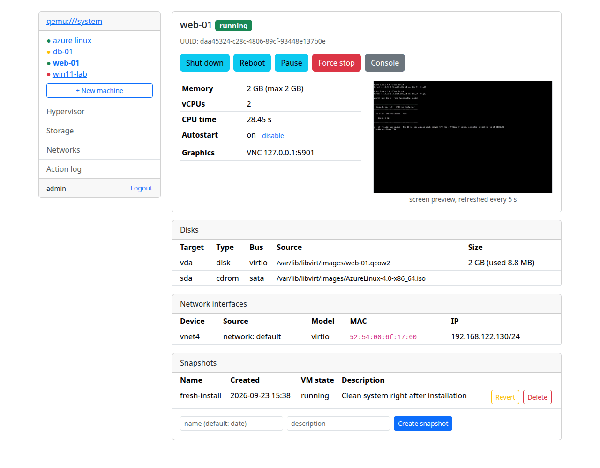
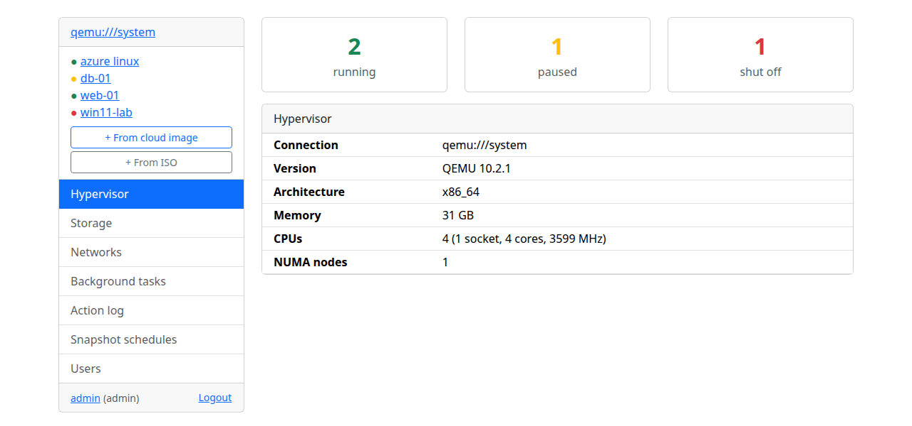
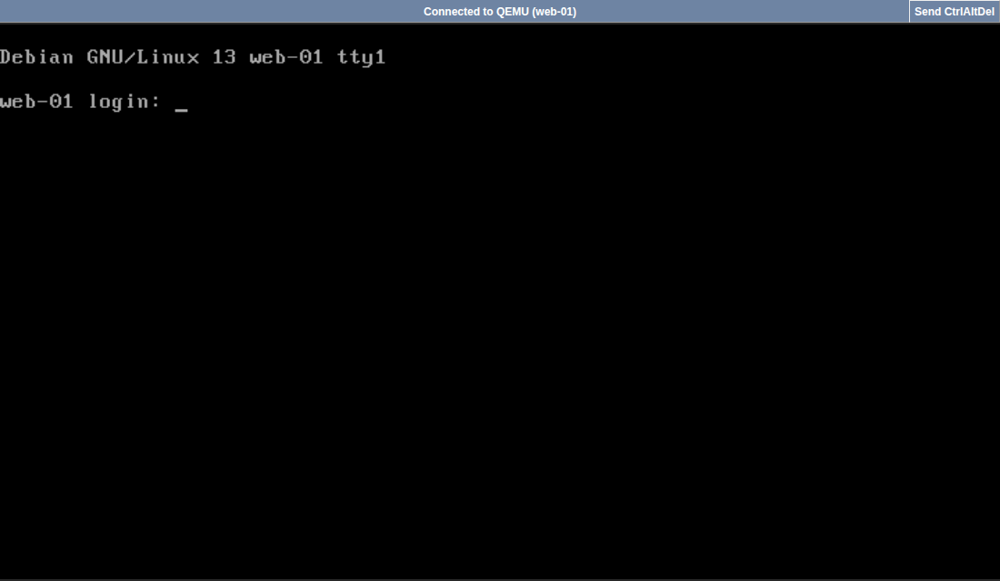
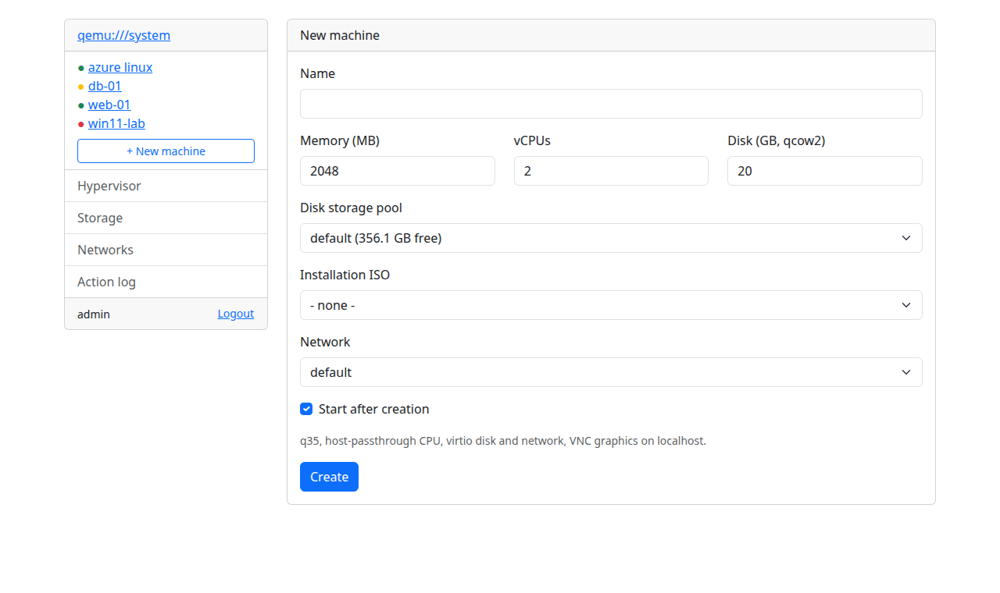
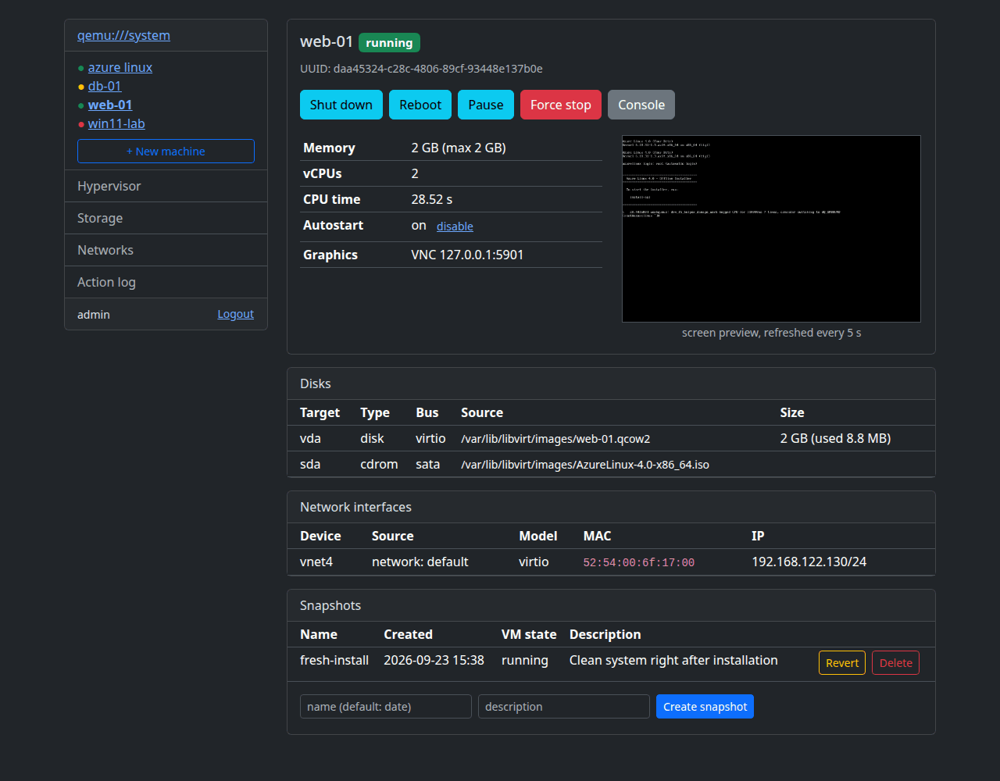
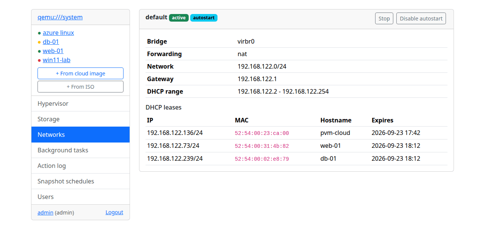
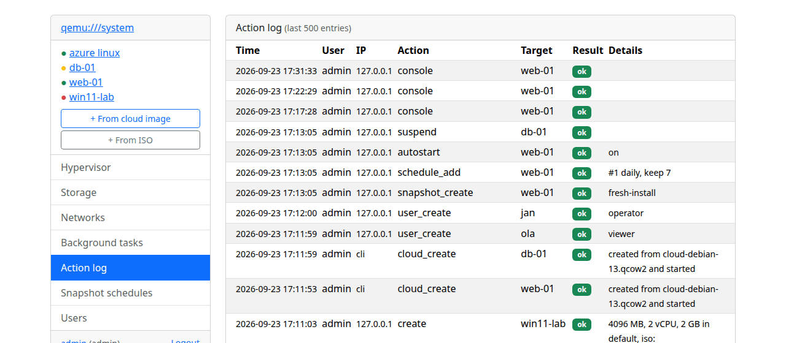

# php-virt-manager

Web panel for libvirt/KVM written in PHP (Smarty 5, Bootstrap 5).

Manage virtual machines from the browser: power actions, snapshots, a noVNC
console, a new machine wizard, storage and network overview - deployable with
one script on nginx or as a Docker container.



## Features

- hypervisor overview, machine list with state indicators
- machine details: memory, vCPUs, disks, network interfaces with guest IPs,
  autostart, live screen preview
- power actions: start, shutdown, reboot, pause/resume, force stop
- machine editing: memory, vCPUs, CD/DVD medium, boot order, new disks and
  network interfaces (hot-plugged into running machines)
- cloning (disks copied in the background) and deleting machines with a
  choice of disks; disks used by other machines are protected
- snapshots: create, revert, delete
- browser console (noVNC via websockify), SPICE to VNC graphics switch
- new machine wizard (qcow2 disk in any active pool, ISO from any pool, network)
- storage pools (start/stop, autostart, refresh) with volumes (create, delete;
  volumes used by machines are protected), libvirt networks (start/stop,
  autostart) with DHCP leases
- users with roles (admin, operator, viewer), login lockout after repeated
  failures, CSRF protection, read-only connections
- several hypervisors (local or `qemu+ssh://`) switchable in the menu
- English and Polish interface (browser language, selectable in the profile)
- light/dark theme following the system preference
- background task queue with a status page
- action log (logins, power actions, snapshots, created machines, user changes)
  with automatic rotation

## Screenshots

| | |
|---|---|
|  |  |
| **Dashboard** - machine states and host info | **Console** - noVNC in the browser |
|  |  |
| **New machine wizard** | **Dark theme** follows the system setting |
|  |  |
| **Networks** with DHCP leases | **Action log** - who did what and when |

## Requirements

- PHP >= 8.2 with the libvirt and SQLite extensions (Debian/Ubuntu:
  `php-libvirt-php`, `php-sqlite3`)
- composer
- access to the libvirt socket (the PHP user must be in the `libvirt` group)
- for the browser console: nginx, websockify and noVNC (see Deployment)

## Quick start (development)

```sh
composer install
mkdir -p templates_c configs cache
cp config-default.php config.php
php -r 'echo password_hash("your-password", PASSWORD_DEFAULT), PHP_EOL;'
# paste the hash into $auth_password_hash in config.php - this account becomes
# the first administrator, further users are managed in the panel
php -d extension=libvirt-php -S 127.0.0.1:8099
# periodic tasks (log rotation, cleanup), normally run every minute:
php -d extension=libvirt-php bin/cron.php
```

The built-in server is for development only; the browser console is not
available there.

### Enabling the libvirt extension

On Ubuntu the `php8.x-libvirt-php` package ships only the `.so` file without
an ini file:

```sh
echo "extension=libvirt-php.so" | sudo tee /etc/php/8.5/mods-available/libvirt.ini
sudo phpenmod libvirt
```

## Deployment

### nginx on the host

```sh
sudo deploy/install.sh
```

The script installs nginx, php-fpm, websockify and noVNC, copies the panel to
`/var/www/php-virt-manager`, creates `config.php` with a random password
(printed at the end), a self-signed TLS certificate, a dedicated php-fpm pool
running with the `libvirt` group, a systemd unit for websockify and a systemd
timer running `bin/cron.php` every minute.

Defaults: HTTPS on port 8443 (HTTP 8090 redirects), websockify on
127.0.0.1:6080. Override with environment variables `APP_DIR`, `HTTPS_PORT`,
`HTTP_PORT`, `WS_PORT`, `PHP_VERSION`. Re-running the script updates the
application and keeps `config.php`, the certificate and `data/`.

### Docker

```sh
docker compose up -d --build
docker compose logs | grep login     # generated password, unless PVM_PASSWORD is set
```

The container uses host networking (VNC consoles listen on the host's
127.0.0.1) and the host libvirt socket (`/var/run/libvirt`); it joins the
socket's group automatically. Panel: `https://<host>:9443/`.

| Variable            | Default          | Description                              |
|---------------------|------------------|------------------------------------------|
| `LIBVIRT_URI`       | `qemu:///system` | libvirt connection                       |
| `PVM_USER`          | `admin`          | first administrator (created on first start) |
| `PVM_PASSWORD`      | random           | its password (or `PVM_PASSWORD_HASH`)    |
| `PVM_READONLY`      | `0`              | `1` = view only                          |
| `HTTPS_PORT`        | `9443`           | HTTPS port                               |
| `HTTP_PORT`         | `9080`           | HTTP port (redirects to HTTPS)           |
| `WS_PORT`           | `6081`           | websockify port on 127.0.0.1             |

The first administrator is stored in the user database on the first start;
later password changes are made in the panel.

Volumes: `/app/data` (user database, action log, login lock data, console tokens),
`/etc/nginx/ssl` (`cert.pem`, `key.pem` - self-signed generated if missing).

### Apache

`.htaccess` blocks internal files and directories (requires
`AllowOverride All`). The browser console needs a websocket proxy and is
supported only with the nginx configuration from `deploy/`.

## Configuration

See `config-default.php`: libvirt connections (`$connections`, each can be
read-only), first administrator, login lockout (`$login_max_attempts`,
`$login_lock_seconds`), data directory, action log rotation and console
settings.

### Users and roles

| Role       | Permissions |
|------------|-------------|
| `viewer`   | read-only access |
| `operator` | power actions, snapshots, console, creating and editing machines |
| `admin`    | everything, including deleting machines, storage and network management, users and the action log |

## Console

The console works for machines with VNC graphics. Machines using SPICE show a
"switch to VNC" action which rewrites the persistent definition (SPICE agent
channel and USB redirection are removed); the change takes effect after the
machine is shut down and started again. Each console opening creates a
one-hour token; the websocket proxy additionally requires a logged in session.

## Development

```sh
composer install
vendor/bin/phpstan analyse
vendor/bin/phpunit
php bin/i18n-strings.php pl     # untranslated strings
```

Translations live in `lang/<code>.php` (English source strings as keys).

`composer install` also copies the Bootstrap CSS to `assets/css/` (the
`vendor/` directory is not served).

`stubs/libvirt.stub.php` declares the libvirt extension API for static
analysis. CI (GitHub Actions) runs lint, PHPStan, PHPUnit, a translation check and a
Docker image build.

## Security notes

- The panel controls machines on `qemu:///system`; use HTTPS and a strong
  password, do not expose it to untrusted networks.
- VNC listens on 127.0.0.1 only; remote access goes through the authenticated
  websocket proxy.
