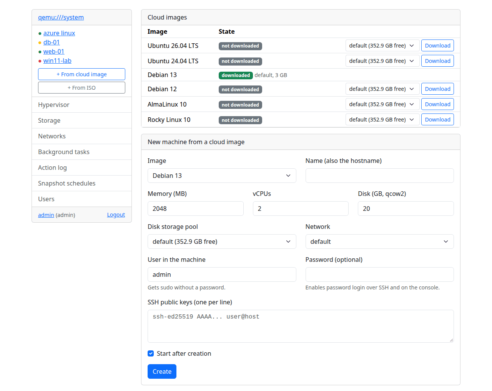
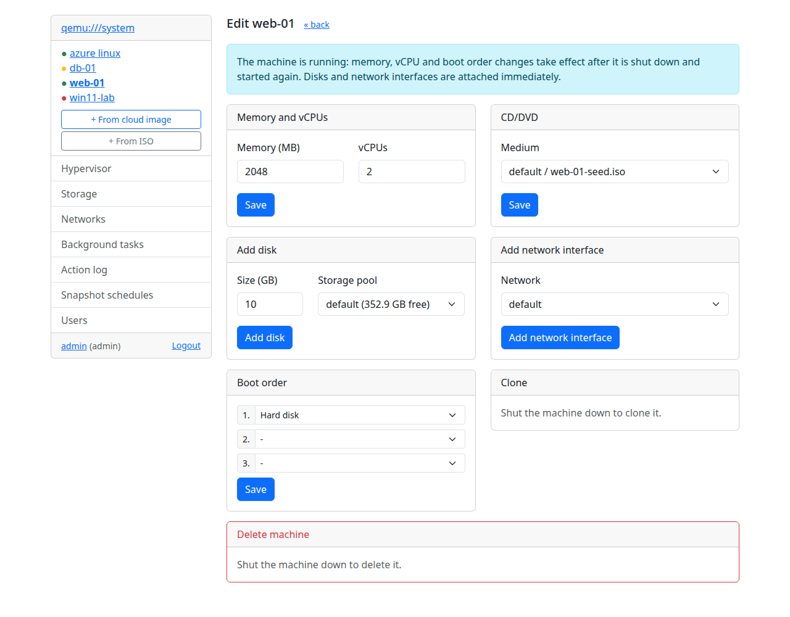
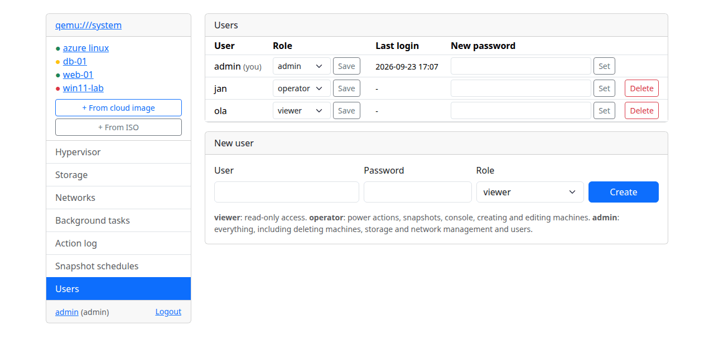
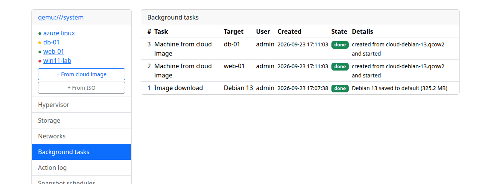

# php-virt-manager

Web panel for libvirt/KVM written in PHP (Smarty 5, Bootstrap 5).

Manage virtual machines from the browser: live charts, snapshots with
schedules, a noVNC console, machines from cloud images with cloud-init,
cloning, users with roles, a REST API - deployable with one script on nginx
or as a Docker container. Interface in English, German, Norwegian, Polish,
Spanish and Ukrainian.


## Features

- hypervisor overview, machine list with state indicators refreshed live
- live charts per machine: CPU, memory, disk and network throughput
- machine details: memory, vCPUs, disks, network interfaces with guest IPs,
  autostart, live screen preview
- power actions: start, shutdown, reboot, pause/resume, force stop
- machine editing: memory, vCPUs, CD/DVD medium, boot order, new disks and
  network interfaces (hot-plugged into running machines)
- cloning (disks copied in the background) and deleting machines with a
  choice of disks; disks used by other machines are protected
- snapshots: create, revert, delete; automatic snapshots hourly, daily or
  weekly with retention (keep the newest N)
- browser console (noVNC via websockify), SPICE to VNC graphics switch
- new machine wizard (qcow2 disk in any active pool, ISO from any pool, network)
- machines from cloud images with cloud-init: Ubuntu 26.04/24.04, Debian 13/12,
  AlmaLinux 10, Rocky Linux 10 (downloaded in the background), user with SSH
  keys and/or password, hostname, disk size - ready to log in within a minute
- storage pools (start/stop, autostart, refresh) with volumes (create, delete;
  volumes used by machines are protected), libvirt networks (start/stop,
  autostart) with DHCP leases
- users with roles (admin, operator, viewer), login lockout after repeated
  failures, CSRF protection, read-only connections
- several hypervisors (local or `qemu+ssh://`) switchable in the menu
- interface in English, German, Norwegian (bokmål), Polish, Spanish and
  Ukrainian (browser language, selectable in the profile)
- light/dark theme following the system preference
- REST API with per-user tokens (same permissions as the user's role)
- background task queue with a status page
- action log (logins, power actions, snapshots, created machines, user changes)
  with automatic rotation

## Screenshots

| | |
|---|---|
|  |  |
| **Dashboard** - machine states and host info | **Console** - noVNC in the browser |
|  |  |
| **Cloud images** - a new machine with cloud-init in a minute | **Dark theme** follows the system setting |
|  |  |
| **Editing** - resources, CD/DVD, hot-plugged disks and NICs, clone, delete | **Users** with admin, operator and viewer roles |
|  |  |
| **Background tasks** - downloads, clones, cloud machines | **Action log** - who did what and when |
|  | |
| **Networks** with DHCP leases | |

## Requirements

- PHP >= 8.2 with the libvirt and SQLite extensions (Debian/Ubuntu:
  `php-libvirt-php`, `php-sqlite3`)
- composer
- access to the libvirt socket (the PHP user must be in the `libvirt` group)
- for the browser console: nginx, websockify and noVNC (see Deployment)
- for cloud images: `xorriso` (or `genisoimage`), `virsh` (`libvirt-clients`)
  and the PHP curl extension

## Quick start (development)

```sh
composer install
mkdir -p templates_c configs cache
cp config-default.php config.php
php -r 'echo password_hash("your-password", PASSWORD_DEFAULT), PHP_EOL;'
# paste the hash into $auth_password_hash in config.php - this account becomes
# the first administrator, further users are managed in the panel
php -d extension=libvirt-php -S 127.0.0.1:8099
# background jobs (image downloads, clones), snapshot schedules and cleanup;
# on a server this runs every minute from systemd/Docker, here keep it running:
php -d extension=libvirt-php bin/cron.php --loop
```

The built-in server is for development only; the browser console is not
available there.

### Enabling the libvirt extension

On Ubuntu the module and its ini file are in separate packages:

```sh
sudo apt install php-libvirt-php php8.5-libvirt-php    # use your PHP version
sudo phpenmod libvirt-php
```

If `php-libvirt-php` is not available, enable the module manually:

```sh
echo "extension=libvirt-php.so" | sudo tee /etc/php/8.5/mods-available/libvirt.ini
sudo phpenmod libvirt
```

## Deployment

### nginx on the host

```sh
sudo deploy/install.sh
```

The nginx configuration also routes `api.php/v1/...` (PATH_INFO) and passes the
`Authorization` header. The script installs nginx, php-fpm, websockify and noVNC, copies the panel to
`/var/www/php-virt-manager`, creates `config.php` with a random password
(printed at the end), a self-signed TLS certificate, a dedicated php-fpm pool
running with the `libvirt` group, a systemd unit for websockify and a systemd
timer running `bin/cron.php` every minute (background jobs, snapshot schedules,
log rotation).

Defaults: HTTPS on port 8443 (HTTP 8090 redirects), websockify on
127.0.0.1:6080. Override with environment variables `APP_DIR`, `HTTPS_PORT`,
`HTTP_PORT`, `WS_PORT`, `PHP_VERSION`. Re-running the script updates the
application and keeps `config.php`, the certificate and `data/`.

### Docker

```sh
docker compose up -d --build
docker compose logs | grep login     # generated password, unless PVM_PASSWORD is set
```

The container uses host networking (VNC consoles listen on the host's
127.0.0.1) and the host libvirt socket (`/var/run/libvirt`); it joins the
socket's group automatically. Panel: `https://<host>:9443/`.

| Variable            | Default          | Description                              |
|---------------------|------------------|------------------------------------------|
| `LIBVIRT_URI`       | `qemu:///system` | libvirt connection                       |
| `PVM_USER`          | `admin`          | first administrator (created on first start) |
| `PVM_PASSWORD`      | random           | its password (or `PVM_PASSWORD_HASH`)    |
| `PVM_READONLY`      | `0`              | `1` = view only                          |
| `TZ`                | `UTC`            | time zone (logs, snapshot schedules)     |
| `HTTPS_PORT`        | `9443`           | HTTPS port                               |
| `HTTP_PORT`         | `9080`           | HTTP port (redirects to HTTPS)           |
| `WS_PORT`           | `6081`           | websockify port on 127.0.0.1             |

The first administrator is stored in the user database on the first start;
later password changes are made in the panel.

Volumes: `/app/data` (user database, action log, login lock data, console tokens),
`/etc/nginx/ssl` (`cert.pem`, `key.pem` - self-signed generated if missing).

### Apache

`.htaccess` blocks internal files and directories (requires
`AllowOverride All`). The browser console needs a websocket proxy and is
supported only with the nginx configuration from `deploy/`.

## Configuration

See `config-default.php`: time zone (default: the system zone), libvirt connections (`$connections`, each can be
read-only), first administrator, login lockout (`$login_max_attempts`,
`$login_lock_seconds`), data directory, action log rotation and console
settings.

### Users and roles

| Role       | Permissions |
|------------|-------------|
| `viewer`   | read-only access |
| `operator` | power actions, snapshots, console, creating and editing machines |
| `admin`    | everything, including deleting machines, storage and network management, users and the action log |

## Cloud images

Base images are downloaded by an administrator (Cloud images page) into a
storage pool as `cloud-<name>.qcow2`. A new machine gets a full copy of the
image grown to the requested size and a small `<name>-seed.iso` with the
cloud-init configuration (NoCloud); the ISO is deleted together with the
machine. More images can be added in `config.php`:

```php
$cloud_images = [
    'fedora-43' => ['label' => 'Fedora 43', 'url' => 'https://.../Fedora-Cloud-Base-43.qcow2'],
];
```

Files are copied into pools with `virsh vol-upload`, because the web server
cannot write to pool directories and `libvirt_stream_send()` of libvirt-php
0.5.x sends corrupted data.

## REST API

JSON API with personal tokens (created in the profile, same permissions as
the user's role): machines, power actions, snapshots, cloning and machines
from cloud images as background jobs, networks and pools.

```sh
curl -H "Authorization: Bearer pvm_..." https://panel.example.com:8443/api.php/v1/domains
```

- Guide with examples (curl, shell, Python, Ansible): [doc/api.md](doc/api.md)
- OpenAPI 3.1 specification: [doc/openapi.yaml](doc/openapi.yaml)

## Console

The console works for machines with VNC graphics. Machines using SPICE show a
"switch to VNC" action which rewrites the persistent definition (SPICE agent
channel and USB redirection are removed); the change takes effect after the
machine is shut down and started again. Each console opening creates a
one-hour token; the websocket proxy additionally requires a logged in session.

## Development

```sh
composer install
vendor/bin/phpstan analyse
vendor/bin/phpunit
php bin/i18n-strings.php de     # untranslated strings of a language
```

Translations live in `lang/<code>.php` (English source strings as keys); a new
language is added to `LANGUAGES` in `lib/i18n.php`. Tests check that every
language is complete and keeps the `%s`/`%d` placeholders.

`composer install` also copies the Bootstrap CSS to `assets/css/` (the
`vendor/` directory is not served).

`stubs/libvirt.stub.php` declares the libvirt extension API for static
analysis. CI (GitHub Actions) runs lint, PHPStan, PHPUnit, a translation check and a
Docker image build.

## Security notes

- The panel controls machines on `qemu:///system`; use HTTPS and a strong
  password, do not expose it to untrusted networks.
- VNC listens on 127.0.0.1 only; remote access goes through the authenticated
  websocket proxy.

## License

php-virt-manager is free software: you can redistribute it and/or modify it
under the terms of the GNU General Public License as published by the Free
Software Foundation, either version 3 of the License, or (at your option) any
later version. See [LICENSE](LICENSE).
